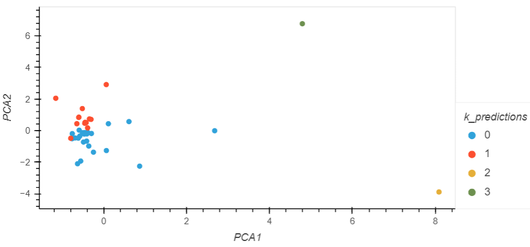

# CryptoClustering
Module 19 for the Vanderbilt Data Analytics Bootcamp 2023

## Original Data Set


## Summary Statistics


## First Scatter plot


## Principal Components
### First Five Rows
```
array([[-0.60066733,  0.84276006,  0.46159457],
       [-0.45826071,  0.45846566,  0.95287678],
       [-0.43306981, -0.16812638, -0.64175193],
       [-0.47183495, -0.22266008, -0.47905316],
       [-1.15779997,  2.04120919,  1.85971527]])
```

### Explained Variance
The following tells us that 37% of the variance may be explained by the first principal component, 35% may be explained by the second principal component, and 18% may be explained by the third principal component. In total, about 90% of the information may be attributed to all three components. 
```
array([0.3719856 , 0.34700813, 0.17603793])
0.8950316570309842
```


# Second Scatter Plot


# Elbow Curves


# Composite Scatter Plot
